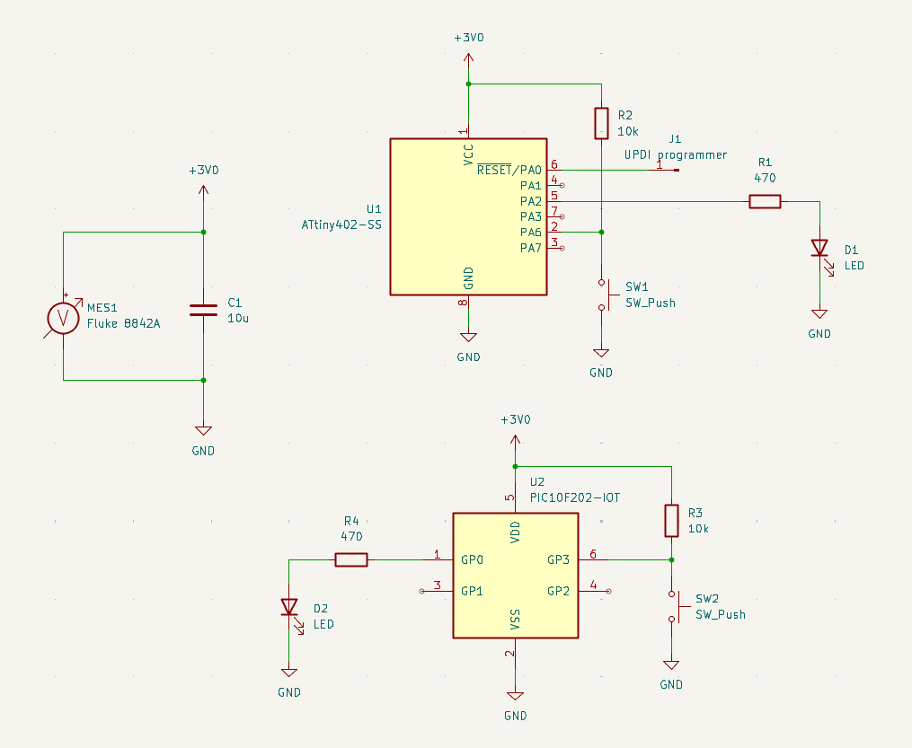
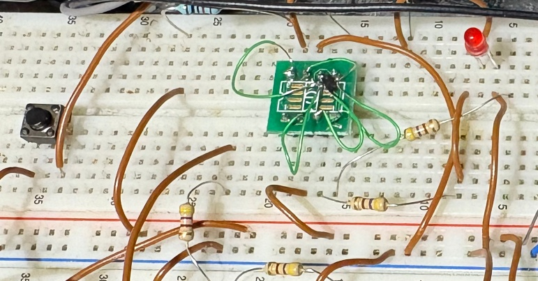

# Ultra-Low Power Sleep Mode Comparison: ATtiny402 vs PIC10F202

## Project Overview
This project demonstrates and compares the ultra-low power sleep capabilities of two modern microcontrollers - the ATtiny402 and PIC10F202. The test program verifies RAM retention during sleep mode and measures actual power consumption using a capacitor discharge method.

## Test Program Functionality
Both microcontrollers run identical test programs that:
1. **Blink Pattern**: LED blinks N times (0.2s on, 0.2s off), followed by 0.5s pause
2. **Sleep Mode**: Press button to enter ultra-low power sleep
3. **RAM Retention Test**: Wake from sleep increments blink count (N+1 blinks)

This pattern proves that RAM contents are preserved even at nanoamp-level sleep currents.

## Circuit Configuration

### ATtiny402 Circuit (Top)
Recently bought from Farnell, ATTINY402-SSNR, Date code: 2305.

### PIC10F202 Circuit (Bottom)
Recently bought from Farnell, PIC10F202T-I/OT, Date code: 2336.

### Capacitor
10 µF, 0805 SMD, Digikey 1276-6456-1-ND, measured: 9.1 µF.

## Test method
The ATtiny was programmed with avrdude and the serialupdi explained [here](https://github.com/SpenceKonde/AVR-Guidance/blob/master/UPDI/jtag2updi.md). After programming, the FTDI adapter was removed.

The 6 pin PIC was soldered to an adapter board for the 8 pin version, and programmed with a MiniPro TL866CS outside of the circuit, and then the adapter board inserted in a breadboard.

For both tests, the following sequence was done:

- connect 3 V from a power supply, the counter was then 1, LED blinks
- the button was pressed, which put it in sleep mode
- pressed again, the counter was 2 and the LED blinks twice in a loop
- button pressed again for sleep mode
- power supply was disconnected
- time measured until voltage reached 2.5 V with the 20 V range of the Fluke 8842A (> 10 gigohm input resistance, measured about 0.65 µF input capacitance)
- connected power supply again
- button pressed to wake it up
- verify that the counter value was retained and now increased to 3 for the LED blink sequence

The Fluke was connected all the time during the tests. To avoid any influence of it, I removed everything completely from the breadboard as well, and measured it again after 10 minutes for the PIC, which resulted in 6 nA instead of 1.6 nA. Probably influenced by the cable or multimeter.

## Power Consumption Results

For the ATtiny402, 185 nA sleep current was measured, and for the PIC10F202, 1.6 nA, but with the Fluke connected.

## Capacitor Discharge Measurement Method

### Theory
When a capacitor powers a circuit, it discharges according to the fundamental equation:

$$I = C \cdot \frac{dV}{dt}$$

Where:
- $I$ = Current (Ampere)
- $C$ = Capacitance (Farad)
- $dV$ = Voltage change (Volt)
- $dt$ = Time interval (seconds)

### ATtiny402 Measurement with 10 µF Capacitor

- **Voltage drop**: 3.0V → 2.5V (ΔV = 0.5V)
- **Time**: 27 seconds
- **Calculation**:
  $$I = 10 \times 10^{-6} \cdot \frac{0.5}{27} = 185.2 \text{ nA}$$

**Result: 185 nA (0.185 µA)** - Within datasheet limits, typical 100 nA.

With a uCurrent in the 1 mV/nA setting: 148 nA.

### PIC10F202 Measurement with 10 µF Capacitor

Test setup for the PIC with the adapter:

- **Voltage drop**: 3.0V → 2.5V (ΔV = 0.5V)
- **Time**: 52 minutes (3,120 seconds)
- **Calculation**:
  $$I = 10 \times 10^{-6} \cdot \frac{0.5}{3120} = 1.60 \text{ nA}$$

**Result: 1.6 nA, but without the Fluke: 6 nA** - Still way below datasheet limits, typical 100 nA at 2 V.

I compared it then with a uCurrent in the 1 mV/nA setting, and could measure 7 nA.

## Software

### Project Structure
The test programs are organized in two MPLAB X projects:
- **ATtiny402**: `attiny402-test.X/`
  - Source: [`main.c`](attiny402-test.X/main.c)
  - Hex file: [`attiny402-test.X.production.hex`](attiny402-test.X/dist/default/production/attiny402-test.X.production.hex)
- **PIC10F202**: `pic10f202-test.X/`
  - Source: [`main.c`](pic10f202-test.X/main.c)
  - Hex file: [`pic10f202-test.X.production.hex`](pic10f202-test.X/dist/default/production/pic10f202-test.X.production.hex)
